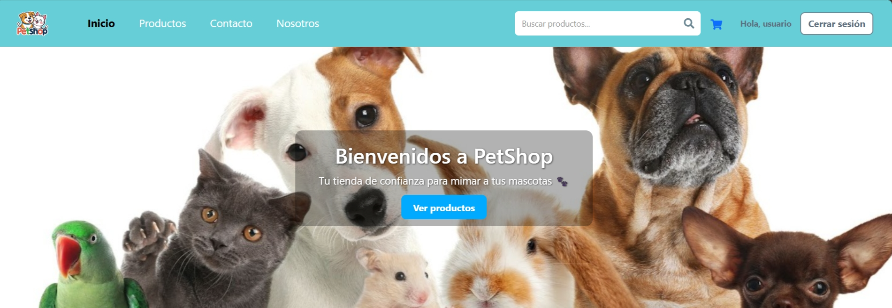

# 🏪 PetShop - Tienda online para mascotas

Bienvenido a **PetShop**, un eCommerce desarrollado con React y Firebase que permite comprar productos para perros y gatos, con funcionalidades de autenticación, carrito de compras, filtros, buscador y panel de administración.

---

## 🚀 Funcionalidades principales

- 🔐 **Autenticación con Firebase**
  - Usuario común: `marcelapopular2011@hotmail.com` / `pep2025`
  - Admin: `admin@admin.com` / `pep2025`
  - Registro de nuevos usuarios: quienes se registren por primera vez deberán usar sus propias credenciales para iniciar sesión.

- 🛒 **Carrito de compras**
  - Agregar, quitar y modificar cantidad de productos
  - Subtotal y total calculados automáticamente
  - Finalizar compra con confirmación

- 📦 **CRUD de productos (solo Admin)**
  - Crear, editar y eliminar productos
  - Visualización condicional de acciones según tipo de usuario

- 🔍 **Buscador + Filtro dinámico**
  - Filtra por nombre o categoría en tiempo real

- 📱 **Responsive Design**
  - Optimizado para escritorio y dispositivos móviles

- 🌐 **Rutas protegidas**
  - Acceso restringido a páginas según tipo de usuario

---

## 🛠️ Tecnologías utilizadas

- **React**
- **Vite**
- **Firebase (Auth + Firestore)**
- **React Router DOM**
- **Context API**
- **SweetAlert2**
- **Bootstrap 5**

---

## 🧪 Pruebas realizadas

- ✅ Responsividad en mobile y desktop
- ✅ Flujo completo de usuario y admin
- ✅ Visualización y carga de productos
- ✅ CRUD funcional con Firestore
- ✅ Comportamiento correcto del carrito

---

## 📁 Instalación local

1. Cloná el repo:
   ```bash
   git clone https://github.com/tu-usuario/petshop.git

2. Instalá las dependencias:

   npm install

3.Configurá las variables de entorno en un archivo .env:

 
VITE_API_KEY=...
VITE_AUTH_DOMAIN=...
VITE_PROJECT_ID=...
VITE_STORAGE_BUCKET=...
VITE_MESSAGING_SENDER_ID=...
VITE_APP_ID=...

4.Iniciá el servidor de desarrollo:

npm run dev


🎯 Objetivo del proyecto
Este proyecto fue desarrollado como entrega final del curso de React. Su objetivo es aplicar todos los conocimientos aprendidos: uso de Firebase, rutas protegidas, componentes reutilizables, paginación, y diseño profesional con Bootstrap.

## 📸 Vista previa




📬 Contacto
Proyecto realizado por Marcela Montojo
📧 marcelapopular2011@hotmail.com
🐾 Gracias por visitar PetShop 💙
